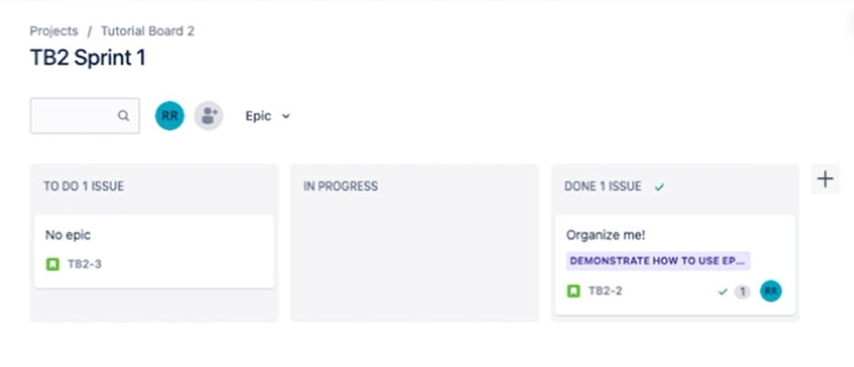
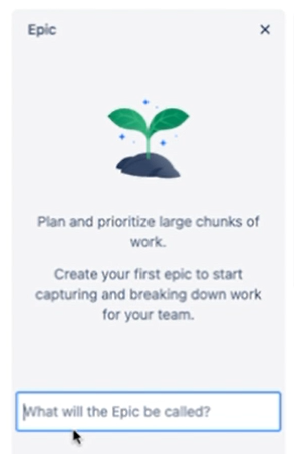
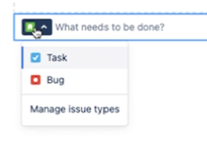
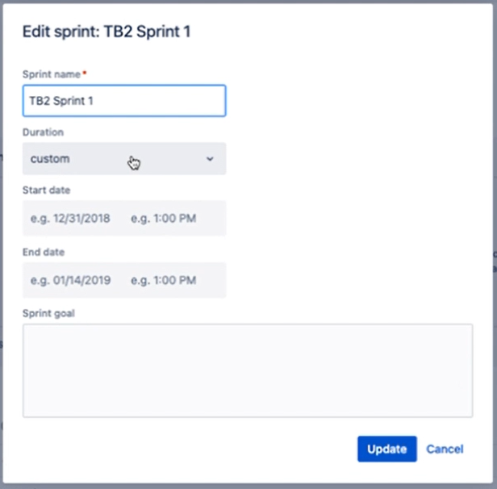
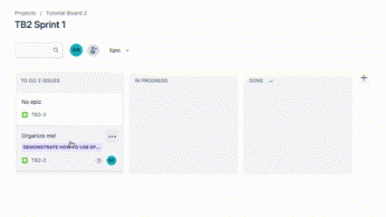
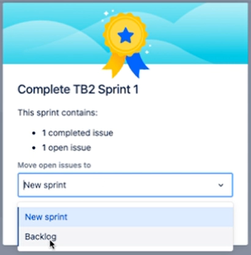

# Manage Sprints

You can break down long-term projects into goal-focused timeboxes called sprints. Each sprint consists of goal-related work items (issues) to complete in a timeframe. On completing a sprint, you should (in theory) achieve the sprint's goal. 

<!-- Note, the issue and epic names in the above video screenshot are not realistic. If I had a JIRA account, I would use issues and epics with realistic names, add them to a sprint, and take a screenshot of them in a Scrum board. -->

Here you will learn how to create, populate, and execute a sprint. 

## Prerequisites

- You have a [JIRA account](./placeholder).
- You have a [JIRA project](./placeholder), based on the JIRA Scrum template.
- Your JIRA account has [admin or project editor permissions](./placeholder).

## Create an epic

Epics represent large chunks of work to accomplish in your project. That work is broken down into issues (tasks) that project team members complete.

1. In your JIRA [Project](./placeholder) left navigation, click `Backlog`. Your backlog appears.

1. In the Epic section, click `+ Create Epic`. An active text field appears, prompting you to name the epic.

    

1. Enter a name for the epic. 

The Epic section lists your newly named epic.

Note: Epics are optional but are an easy way to organize tasks.

## Create an issue

Use issues to define all your project work. Issues can represent user stories, tasks, bugs, and more.

1. Go to your project [Backlog](./placeholder).

1. In the Epic section, select an epic in which to put the issue.

    Note, issues need not be part of an epic. To create an issue without any epic, select `Issues without epic` at the top of the Epic section.

1. Click `+ Create issue`. A small issue editor appears, for setting the new issue's type and description.

1. Set the issue's type, by selecting a type from the type icon dropdown. We use the `Story` issue type (green icon with white bookmark) for planning project work.

    

1. In the text field, describe the work to be done.

The Backlog section lists the issue, including an auto-generated ID and the issue description.

Create as many issues as you want to represent project work items.

## Edit an issue

1. In your [Project](./placeholder), select the issue you want to edit. The issue editor appears on the right side.

1. Click on an issue field to start changing its value. Update any attribute, including the issue's story points, description, assignee, epic, and more.

    *IMPORTANT: For `Story point estimate`, enter the number of days estimated to complete the story. Story points help you plan which stories are feasible to do in a sprint.*

## Create a sprint

Every Scrum project comes with a sprint by default. You can edit the default sprint or create new ones. Here we'll edit the default sprint.

1. Go to your project [Backlog](./placeholder).

1. Click `Add dates` (pencil icon) next to the default sprint name.

    

    The sprint editor appears.

    

    Note, if you wanted to create a new sprint you would click `Create sprint` which would bring up a sprint editor for the new sprint.

1. Edit any of the sprint attributes, and then click `Update`.

## Add issues to a sprint

Specify the work to complete in a sprint by adding the work issues to the sprint.

1. Go to your project [Backlog](./placeholder).

1. Drag an issue from the `Backlog` section to the sprint you plan to complete it in. Repeat this step for every issue you plan to complete in the current sprint, and any other sprint you want to plan.

**WARNING: Add to the current sprint only the issues you plan to complete in it.**

## Start a sprint

Starting a sprint populates the Scrum board with the sprint issues and starts metrics gathering on the sprint.

1. Go to your project [Backlog](./placeholder).

1. Click `Start sprint`.

Your sprint, and its issues, are now active and ready to work on.

## Update issue status

The Scrum board is an easy place to monitor sprint progress and update issue status. The goal is to complete all sprint issues before the end of the sprint.

1. In your [Project](./placeholder) left navigation, click `Board`. Your Scrum board appears, showing the current sprint issues in the three columns:

    - `TODO`
    - `IN PROGRESS`
    - `DONE`

    Unless previously started, each issue starts with status `TODO`.

1. Update an issue's status by dragging the issue to the column representing its new status.

    

## Complete a sprint

When the sprint has expired, mark the sprint complete.

1. In your project [Board](./placeholder), click `Complete sprint`. A sprint completion dialogue appears, listing the count of completed issues and open issues.

    

1. Determine what to do with the remaining open issues by selecting an option from the `Move open issues to` selector.

    - `New sprint`: Creates a new sprint and moves the issues to that sprint.
    - `Backlog`: Moves the issues to the backlog.

You completed the sprint.

Congratulations! You now know how to create, start, and complete a sprint.

## Related documentation

- [Manage Projects](./placeholder)
- [Generate Reports](./placeholder)